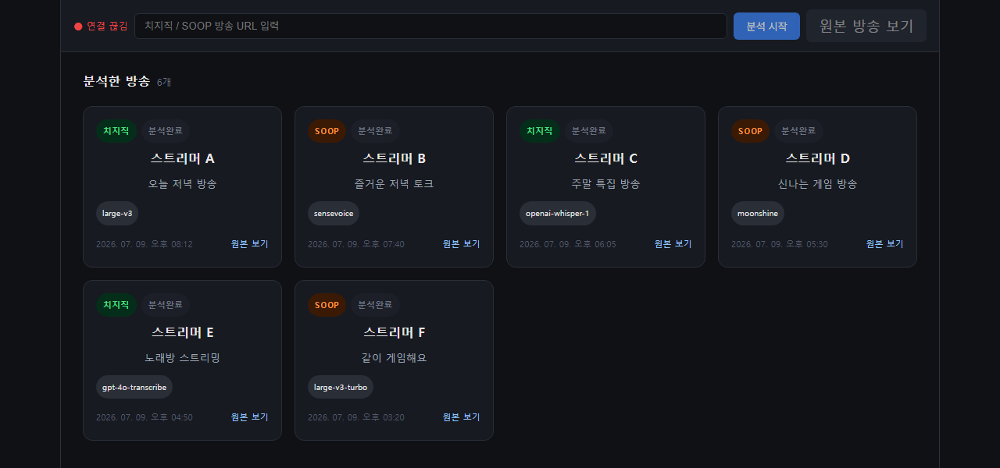
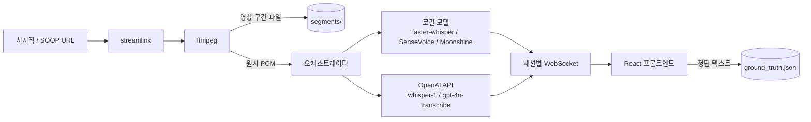

<div align="center">

# 🎙️ STT 모델 비교 웹앱

**치지직 · SOOP 라이브 방송을 여러 STT 모델로 동시에 받아쓰기하고, 결과를 나란히 비교하는 도구**

[](https://www.python.org/)
[](https://fastapi.tiangolo.com/)
[](https://react.dev/)
[](https://vitejs.dev/)
[](#license)

</div>

---

## 스크린샷

<div align="center">
  
  <p><sub>홈 화면 — 지금까지 분석한 방송을 카드로 모아 보고, 클릭하면 그때 화면을 그대로 다시 볼 수 있습니다.</sub></p>
</div>

> 구간별 리뷰 화면(채팅 목록 + 영상/모델분석/정답 패널) 스크린샷도 `screenshots/chat-view.png`로 추가하면 자동으로 아래에 표시되도록 링크만 걸어두었습니다:
> ``

## 왜 만들었나

라이브 방송 하이라이트 자동 요약 파이프라인에 어떤 STT(음성 인식) 모델을 쓸지 고르기 위해 만든 **선별용 실험 도구**입니다. 같은 방송 오디오를 여러 모델에 동시에 흘려보내고, 정확도·속도·비용을 직접 눈으로 비교할 수 있습니다.

## 주요 기능

- **실시간 캡처 & 분석**: 치지직/SOOP 방송 URL만 넣으면 `streamlink` + `ffmpeg`로 오디오를 받아 청크 단위로 STT 모델에 전달
- **로컬 모델 5종 + API 모델 3종** 비교 지원 (아래 표 참고)
- **멀티세션**: 인원 제한 없이 여러 명이 동시에 각자 다른 모델/방송을 분석 가능 (세션별로 결과가 분리됨)
- **구간별 리뷰**: 채팅 항목을 클릭하면 해당 구간 영상(자동재생) + 모델 텍스트 + 정답 입력창이 함께 열림
- **정답 라벨링**: 사람이 실제로 들은 내용을 입력해 저장 — 모델 정확도를 나중에 정량 비교할 수 있는 데이터셋으로 축적
- **지난 세션 다시 보기**: 홈 화면에서 이전에 분석한 방송 카드를 클릭하면 그때 그 화면을 그대로 복원
- **OpenAI API 사용량 실시간 표시**: 요청 수 · 처리한 오디오 길이 · 추정 비용
- **새로고침해도 안전**: 분석 도중 새로고침해도 진행 중이던 세션에 다시 붙어서 중지 버튼이 복원됨

## 지원 모델

| 모델 | 종류 | 비고 |
|---|---|---|
| faster-whisper (large-v3) | 로컬 | 정확도 기준점 |
| faster-whisper (large-v3-turbo) | 로컬 | large-v3와 비슷한 정확도, 훨씬 빠름 |
| faster-whisper (medium) | 로컬 | 크기 대비 속도/정확도 균형 |
| SenseVoice | 로컬 | 비-Whisper 계열, CPU에서 빠름 |
| Moonshine-tiny-ko | 로컬 | 한국어 파인튜닝, 초경량(2,700만 파라미터) |
| OpenAI Whisper API (`whisper-1`) | API | 과금 발생 |
| OpenAI GPT-4o Transcribe | API | 과금 발생 |
| OpenAI GPT-4o mini Transcribe | API | 과금 발생 |

## 아키텍처



로컬 모델은 CPU 자원을 직접 쓰고, API 모델은 오디오를 OpenAI로 전송해 처리를 위임합니다. 세션마다 독립된 캡처 프로세스와 WebSocket 채널을 가지므로 여러 명이 동시에 써도 서로의 결과가 섞이지 않습니다.

## 시작하기

### 요구 사항

- Python 3.11
- Node.js 20+
- [ffmpeg](https://ffmpeg.org/) (PATH에 등록되어 있어야 함)

### 백엔드

```bash
cd backend
python -m venv venv
venv\Scripts\activate          # Windows
pip install -r requirements.txt              # API 모델만 (경량)
# 로컬 모델까지 쓰려면 추가로:
pip install faster-whisper funasr torch transformers

cp .env.example .env           # OPENAI_API_KEY 입력
uvicorn main:app --reload
```

### 프론트엔드

```bash
cd frontend
npm install
npm run dev
```

`http://localhost:5173`에서 접속합니다.

## 배포

`Dockerfile` + `render.yaml`이 포함되어 있어 [Render](https://render.com)에서 바로 Blueprint로 배포할 수 있습니다. 배포 이미지는 API 모델만 지원하는 경량 구성입니다(로컬 모델용 torch 등은 수 GB라 제외).

1. Render 대시보드 → **New +** → **Blueprint** → 이 저장소 선택
2. 환경변수 `OPENAI_API_KEY`에 실제 키 입력 (레포에는 저장되지 않음)
3. 배포 완료 후 생성된 URL을 팀원들과 공유

## 프로젝트 구조

```
audio/
├── backend/
│   ├── main.py              # FastAPI 앱, 세션 관리, WebSocket
│   ├── capture.py           # streamlink + ffmpeg 캡처
│   ├── orchestrator.py      # 청크 → 모델 디스패치
│   └── adapters/            # 모델별 어댑터 (공통 인터페이스)
├── frontend/
│   └── src/App.jsx          # 전체 UI
├── Dockerfile
└── render.yaml
```

## License

MIT
